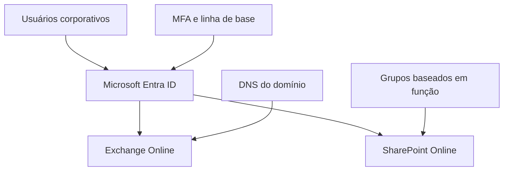

# Implantação Microsoft 365: Exchange Online, SharePoint Online e Entra ID

> Projeto profissional real, documentado com identificadores e arquitetura anonimizados. O repositório deve permanecer privado enquanto a autorização formal de publicação estiver em análise.

## Resumo executivo

Este repositório descreve a implantação de um ambiente Microsoft 365 para uma organização de serviços profissionais. A entrega reuniu identidade, e-mail corporativo, colaboração documental e controles básicos de segurança em uma plataforma integrada.

O trabalho foi executado por um consultor independente e abrangeu a preparação do tenant, validação de domínio, provisionamento de usuários e licenças, implantação do Exchange Online, criação de um site de equipe no SharePoint Online, organização de bibliotecas por função, controle de acesso baseado em grupos e configuração de mecanismos de proteção de identidade e e-mail.

Os dados históricos do provedor de e-mail anterior e de repositórios documentais não fizeram parte da transição. O ambiente foi colocado em produção em 2026 e permanece sob suporte administrativo.

## Contexto anonimizado

A organização utilizava um serviço de e-mail externo e não possuía uma plataforma corporativa estruturada para armazenamento e colaboração documental. O projeto buscou centralizar esses serviços no Microsoft 365, mantendo segregação lógica de acesso e reduzindo a administração manual por usuário.

Nenhum nome, domínio, endereço, grupo, biblioteca, pasta ou parâmetro real do cliente é utilizado nesta documentação.

## Problema identificado

- Ausência de armazenamento corporativo centralizado.
- Necessidade de separar documentos conforme função de trabalho.
- Serviço de e-mail fora do ecossistema Microsoft 365.
- Necessidade de identidade centralizada e autenticação multifator.
- Administração de acesso sem uma documentação técnica consolidada.

## Objetivos

- Preparar um tenant Microsoft 365 para uso corporativo.
- Validar um domínio personalizado sem expor seus registros reais.
- Implantar caixas de usuário no Exchange Online.
- Disponibilizar endereços alternativos e um grupo funcional de distribuição.
- Criar um site de equipe privado no SharePoint Online.
- Organizar o conteúdo em bibliotecas funcionais.
- Associar o acesso a grupos de segurança, evitando concessões individuais como modelo principal.
- Aplicar uma linha de base de segurança de identidade.
- Configurar autenticação do domínio de e-mail.
- Documentar verificações, limitações e decisões de mudança.

## Escopo implementado

- Configuração administrativa do Microsoft 365.
- Adição e validação de domínio personalizado.
- Provisionamento de identidades e licenças Microsoft 365 Business Basic.
- Criação de caixas de usuário no Exchange Online.
- Configuração de aliases sem exposição do inventário real.
- Criação de lista de distribuição funcional.
- Configuração de registros para roteamento e autenticação de e-mail.
- Implantação de site de equipe privado no SharePoint Online.
- Criação de bibliotecas funcionais com versionamento padronizado.
- Criação de grupos de segurança orientados a funções.
- Aplicação de permissões por grupos.
- Habilitação dos Padrões de Segurança do Microsoft Entra ID.
- Uso de autenticação multifator com Microsoft Authenticator.
- Avaliação da postura por meio de recurso nativo do Microsoft 365.
- Suporte administrativo após a entrada em produção.

## Fora do escopo ou não comprovado

- Migração do histórico de mensagens do provedor anterior.
- Migração documental inicial.
- Configuração individual do Outlook para desktop.
- Configuração de dispositivos móveis.
- Implantação específica do OneDrive além das configurações organizacionais relacionadas.
- Teste interativo nas contas dos colaboradores.
- Treinamento formal de usuários.

## Tecnologias utilizadas

- Microsoft 365 Admin Center
- Microsoft Entra ID
- Exchange Online
- SharePoint Online
- Microsoft Defender
- Microsoft Secure Score
- Microsoft Authenticator
- DNS
- PowerShell para consultas de resolução DNS
- Git e GitHub para documentação técnica

## Arquitetura lógica

O diagrama é conceitual. Ele não representa nomes, quantidades, relações de acesso ou parâmetros reais do ambiente.

## Medidas de segurança adotadas

- Padrões de Segurança do Microsoft Entra ID habilitados.
- Autenticação multifator baseada em senha e Microsoft Authenticator.
- Controle de acesso ao SharePoint baseado em grupos.
- Site de equipe configurado como privado.
- Versionamento habilitado nas bibliotecas documentais.
- SPF, DKIM e DMARC configurados para o domínio de e-mail.
- Princípio de não acessar caixas de colaboradores durante a validação.
- Preservação de registros legados quando sua remoção poderia causar impacto não controlado.
- Uso de evidências privadas separadas da documentação de portfólio.

## Transição e validações

A mudança para o Exchange Online foi tratada como transição de serviço, e não como migração de histórico. O roteamento de e-mail e os mecanismos de autenticação do domínio foram verificados por consoles administrativos e consultas DNS.

O teste interativo de MFA foi realizado somente em uma conta administrativa autorizada. Não foram acessadas contas ou caixas de colaboradores. As demais validações foram limitadas ao estado administrativo do ambiente e ao uso operacional informado pelo responsável.

Consulte [testes e validações](docs/10-testes-e-validacoes.md) e [transição de serviços](docs/09-transicao-de-servicos.md).

## Resultados comprovados

- Ambiente Microsoft 365 colocado em produção em 2026.
- Serviço de e-mail corporativo operando no Exchange Online.
- Domínio personalizado validado.
- Organização documental implantada no SharePoint Online.
- Acesso às bibliotecas associado a grupos funcionais.
- Versionamento documental padronizado.
- Linha de base de segurança de identidade habilitada.
- Autenticação do domínio de e-mail configurada.
- Suporte administrativo contínuo após a implantação.

Não são apresentadas métricas de redução de incidentes, produtividade ou economia, pois não foram coletadas evidências que sustentem essas afirmações.

## Limitações

- Não houve migração do histórico de e-mails ou de documentos.
- A validação de login ficou restrita à conta administrativa.
- Registros antigos foram preservados por cautela operacional.
- A evidência mais recente da pontuação de segurança não foi confirmada.
- A autorização escrita para publicação ainda está em análise.
- Nenhuma captura administrativa original foi aprovada para publicação.

## Lições aprendidas

- Diferenciar transição de serviço de migração de dados evita afirmações técnicas imprecisas.
- Grupos funcionais simplificam a administração de acesso e a revisão posterior.
- Alterações em DNS de produção devem considerar dependências não documentadas e possuir plano de reversão.
- Validações devem respeitar privacidade, segregação de funções e autorização de acesso.
- Uma evidência técnica útil internamente pode ser inadequada para um portfólio público.

## Estrutura da documentação

- [Visão geral](docs/01-visao-geral.md)
- [Cenário inicial](docs/02-cenario-inicial.md)
- [Requisitos e escopo](docs/03-requisitos-e-escopo.md)
- [Arquitetura](docs/04-arquitetura.md)
- [Identidade e acesso](docs/05-identidade-e-acesso.md)
- [Exchange Online](docs/06-exchange-online.md)
- [SharePoint e OneDrive](docs/07-sharepoint-e-onedrive.md)
- [Segurança de e-mail](docs/08-seguranca-de-email.md)
- [Transição de serviços](docs/09-transicao-de-servicos.md)
- [Testes e validações](docs/10-testes-e-validacoes.md)
- [Boas práticas de segurança](docs/11-boas-praticas-de-seguranca.md)
- [Limitações e pendências](docs/12-limitacoes-e-pendencias.md)
- [Lições aprendidas](docs/13-licoes-aprendidas.md)
- [Evidências públicas](docs/14-evidencias-publicas.md)
- [Operação e suporte](docs/15-operacao-e-suporte.md)

## Competências demonstradas

- Administração Microsoft 365.
- Microsoft Entra ID e autenticação multifator.
- Exchange Online e segurança de e-mail.
- SharePoint Online e governança documental.
- DNS e validação de serviços.
- Controle de acesso baseado em grupos.
- Gestão de mudanças em produção.
- Documentação técnica e análise de confidencialidade.

## Confidencialidade

Todas as informações foram reconstruídas em formato genérico. Evidências brutas, inventários, registros DNS, nomes, contas, estruturas de acesso e configurações que possam facilitar reconhecimento do ambiente permanecem fora deste repositório.

Leia [NOTICE.md](NOTICE.md), [SECURITY.md](SECURITY.md) e [PUBLICATION-READINESS.md](PUBLICATION-READINESS.md) antes de reutilizar ou publicar qualquer conteúdo.

## Status

**Implantação concluída em 2026, com suporte administrativo contínuo.**

**Publicação pública bloqueada até autorização escrita e revisão final de confidencialidade.**
