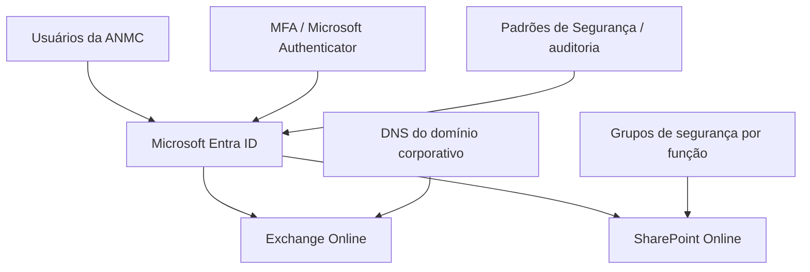
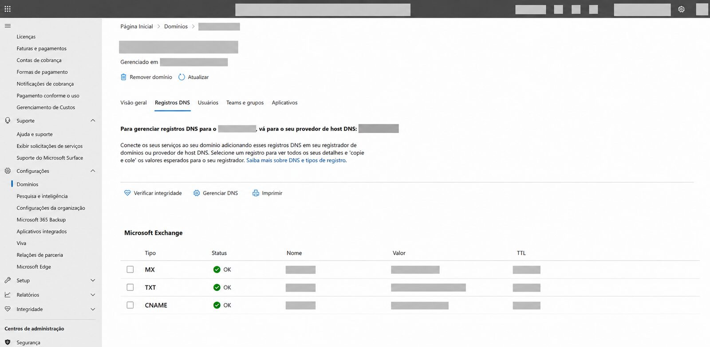
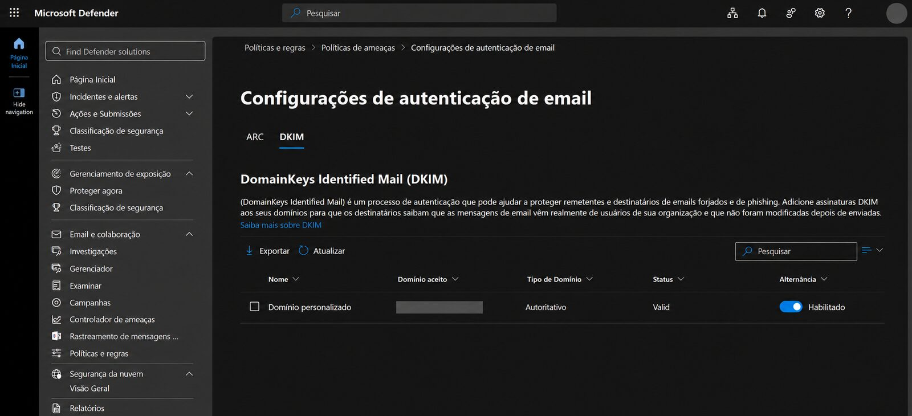

# Implantação Microsoft 365 — Matheus Cavalcanti Advocacia e Negócios

> **Divulgação autorizada:** este projeto é apresentado como parte do meu portfólio profissional com autorização da empresa envolvida. O uso do nome, identidade visual e evidências apresentadas foi autorizado para fins de demonstração profissional. Informações pessoais, credenciais e dados operacionais sensíveis foram omitidos ou censurados.

## Identificação do projeto

- **Empresa:** Matheus Cavalcanti Advocacia e Negócios (ANMC)
- **Responsável técnico:** Gabriel Cerqueira
- **Atuação:** Consultoria de TI — projeto independente
- **Período:** abril–maio de 2026
- **Status:** implantação concluída, com suporte administrativo posterior

## Contexto

A empresa utilizava um serviço de e-mail externo e precisava estruturar uma plataforma corporativa para comunicação, identidade e colaboração documental.

O projeto teve como objetivo implantar o Microsoft 365 como base central do ambiente, reunindo Exchange Online, Microsoft Entra ID e SharePoint Online, além de controles de segurança, autenticação multifator e configuração dos registros necessários para o domínio corporativo.

A implantação foi executada diretamente no ambiente de produção, com validações controladas e preservação dos serviços legados quando sua remoção pudesse gerar impacto não mapeado.

## Escopo realizado

- Preparação e configuração administrativa do Microsoft 365.
- Validação e configuração do domínio corporativo.
- Provisionamento de usuários e licenças Microsoft 365 Business Basic.
- Implantação de caixas de e-mail no Exchange Online.
- Configuração de aliases e lista de distribuição funcional.
- Configuração de SPF, DKIM, DMARC e Autodiscover.
- Implantação de site de equipe no SharePoint Online.
- Organização de bibliotecas documentais por função de negócio.
- Versionamento de documentos.
- Estruturação de grupos de segurança e permissões por função.
- Habilitação de autenticação multifator com Microsoft Authenticator.
- Aplicação dos Padrões de Segurança do Microsoft Entra ID.
- Validação da postura de segurança com recursos nativos do Microsoft 365.
- Habilitação e validação dos recursos administrativos de auditoria aplicáveis ao ambiente.
- Suporte administrativo após a entrada em produção.

## Arquitetura da solução

A representação acima descreve os principais componentes implantados sem expor identificadores técnicos ou relações internas sensíveis.

## Atividades executadas

### Microsoft Entra ID e identidade

- Criação e administração das identidades corporativas.
- Associação das licenças contratadas.
- Estruturação de grupos para administração de acesso.
- Habilitação de MFA e Padrões de Segurança.
- Validação administrativa do fluxo de autenticação.

### Exchange Online

- Provisionamento das caixas corporativas.
- Configuração dos endereços alternativos previstos no projeto.
- Criação da lista de distribuição funcional.
- Validação do fluxo de mensagens após a transição.
- Configuração e verificação dos registros de autenticação do domínio.

### SharePoint Online

- Criação de site de equipe privado.
- Estruturação das bibliotecas por área de negócio.
- Aplicação de permissões por grupos funcionais.
- Configuração de versionamento documental.
- Validação da organização e do acesso administrativo.

### DNS e segurança de e-mail

- Validação do domínio Microsoft 365.
- Configuração de registros necessários ao Exchange Online.
- Configuração de SPF.
- Habilitação de DKIM.
- Configuração inicial de DMARC.
- Validação por console administrativo e consultas DNS.

## Evidências do projeto

As capturas incluídas demonstram a execução prática do projeto. A identidade da empresa pode ser apresentada por autorização expressa, porém dados pessoais, contas, IDs, URLs administrativas, valores DNS e outros elementos operacionais sensíveis continuam censurados.

| SharePoint Online | Autenticação multifator |
|---|---|
|  |  |
| **DNS / Exchange Online** | **DKIM** |
|  |  |

A galeria completa está disponível em [Evidências públicas](docs/14-evidencias-publicas.md). As páginas técnicas abaixo também apresentam cada evidência junto da configuração correspondente.

## Resultados alcançados

- Microsoft 365 implantado e colocado em produção.
- E-mail corporativo operando no Exchange Online.
- Domínio corporativo validado e integrado ao Microsoft 365.
- SPF, DKIM e DMARC configurados.
- SharePoint Online disponibilizado como repositório corporativo central.
- Estrutura documental organizada por função de negócio.
- Permissões centralizadas em grupos de segurança.
- Versionamento documental habilitado.
- MFA habilitado para proteção das identidades.
- Linha de base de segurança do Microsoft Entra ID aplicada.
- Ambiente mantido sob suporte administrativo após a implantação.

## Tecnologias utilizadas

- Microsoft 365 Admin Center
- Microsoft Entra ID
- Exchange Online
- SharePoint Online
- Microsoft Defender
- Microsoft Secure Score
- Microsoft Authenticator
- DNS
- PowerShell

## Responsabilidades desempenhadas

Como responsável técnico pela implantação, atuei diretamente em:

- levantamento do cenário e definição do escopo técnico;
- preparação do tenant Microsoft 365;
- administração de identidades e licenças;
- implantação e configuração do Exchange Online;
- implantação e estruturação do SharePoint Online;
- definição do modelo de grupos e permissões;
- configuração de MFA e controles de segurança;
- configuração e validação dos registros DNS;
- testes administrativos e validação da entrada em produção;
- documentação técnica da solução;
- suporte administrativo após a implantação.

## Limitações do escopo

- O histórico de mensagens do provedor anterior não foi migrado.
- A migração documental inicial não fez parte desta entrega.
- A configuração individual do Outlook desktop e de dispositivos móveis não integrou o escopo formal.
- Testes interativos em contas de colaboradores não foram realizados; as validações respeitaram o limite de acesso autorizado.

## Documentação técnica

- [Visão geral](docs/01-visao-geral.md)
- [Cenário inicial](docs/02-cenario-inicial.md)
- [Requisitos e escopo](docs/03-requisitos-e-escopo.md)
- [Arquitetura](docs/04-arquitetura.md)
- [Identidade e acesso](docs/05-identidade-e-acesso.md)
- [Exchange Online](docs/06-exchange-online.md)
- [SharePoint e OneDrive](docs/07-sharepoint-e-onedrive.md)
- [Segurança de e-mail](docs/08-seguranca-de-email.md)
- [Transição de serviços](docs/09-transicao-de-servicos.md)
- [Testes e validações](docs/10-testes-e-validacoes.md)
- [Boas práticas de segurança](docs/11-boas-praticas-de-seguranca.md)
- [Limitações e pendências](docs/12-limitacoes-e-pendencias.md)
- [Evidências públicas](docs/14-evidencias-publicas.md)
- [Operação e suporte](docs/15-operacao-e-suporte.md)

## Competências demonstradas

- Administração Microsoft 365.
- Microsoft Entra ID e MFA.
- Exchange Online.
- SharePoint Online e governança documental.
- Segurança e autenticação de e-mail.
- DNS.
- Controle de acesso baseado em grupos.
- Gestão de mudanças em produção.
- Documentação técnica.
- Suporte administrativo Microsoft 365.

## Confidencialidade e autorização

A divulgação deste projeto, incluindo a identificação da **Matheus Cavalcanti Advocacia e Negócios** e o uso de sua identidade visual, foi autorizada para fins de portfólio profissional.

A autorização não altera os critérios de proteção de dados adotados na documentação. Permanecem fora do repositório credenciais, tokens, identificadores técnicos sensíveis, inventários completos de usuários, conteúdo de caixas postais, documentos corporativos, dados pessoais, matrizes detalhadas de acesso e demais informações que possam representar risco operacional ou exposição desnecessária do ambiente.

Consulte também [NOTICE.md](NOTICE.md) e [SECURITY.md](SECURITY.md).

## Status

**Implantação concluída em maio de 2026. Projeto autorizado para divulgação como portfólio profissional, mantendo a proteção dos dados operacionais sensíveis.**
