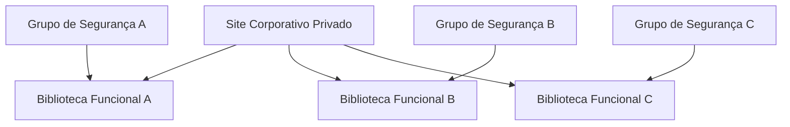

# 07 — SharePoint Online e OneDrive

## SharePoint Online

Foi implantado um site de equipe privado para centralizar a colaboração documental da empresa.

A captura demonstra o ambiente implantado sem expor URL, armazenamento, conta administrativa ou demais identificadores operacionais.

## Organização documental

O conteúdo foi estruturado em bibliotecas funcionais e o acesso foi associado a grupos baseados nas funções de trabalho.

O diagrama representa o modelo adotado sem reproduzir nomes ou relações internas do ambiente.

## Permissões por grupos

O modelo principal de acesso foi baseado em grupos, facilitando a administração e evitando concessões individuais como padrão.

Permissões exclusivas ou exceções específicas permanecem fora do portfólio.

## Versionamento

As bibliotecas foram configuradas com versionamento de documentos. Uma biblioteca foi utilizada como evidência visual da configuração padronizada aplicada ao ambiente.

Parâmetros numéricos detalhados foram omitidos por não serem necessários para demonstrar a implantação.

## Compartilhamento

O site permaneceu privado. A capacidade de colaboração externa foi analisada administrativamente, mas não havia convidados no estado observado durante a documentação do projeto.

## OneDrive

O OneDrive esteve presente nas configurações organizacionais do Microsoft 365, porém não houve uma implantação individual ou frente específica de OneDrive neste projeto. Por isso, ele não é apresentado como entrega independente.
