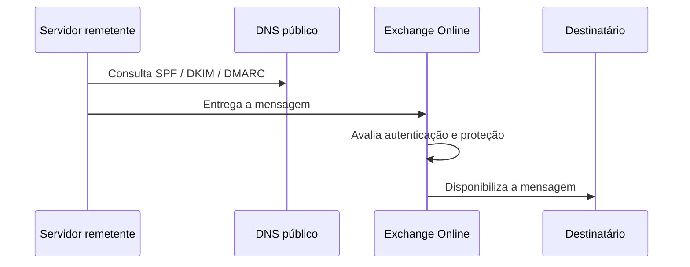

# 08 — Segurança de e-mail

## Objetivo

A configuração de segurança de e-mail teve como objetivo integrar corretamente o domínio ao Exchange Online e reduzir riscos de falsificação de remetente por meio dos mecanismos de autenticação disponíveis.

## Controles implementados

| Controle | Estado |
|---|---|
| Validação de domínio | Concluída |
| Roteamento de e-mail | Configurado |
| SPF | Configurado |
| Autodiscover | Configurado |
| DKIM | Habilitado no domínio personalizado |
| DMARC | Publicado e validado por consulta DNS |

### Domínio e registros do Exchange Online

A evidência demonstra a validação administrativa dos registros necessários sem publicar domínio, destinos ou valores reais.

## DKIM

O domínio personalizado foi validado e teve a assinatura DKIM habilitada.

Seletores, domínio automático do tenant e demais parâmetros foram removidos da versão pública.

## DMARC

A publicação do registro DMARC foi confirmada por consulta DNS.

A captura preserva a comprovação do teste, mas omite domínio, resolvedor, TTL e demais valores operacionais.

## Fluxo conceitual

## Registros legados

Registros associados ao ambiente anterior foram preservados quando suas dependências não estavam integralmente inventariadas. A decisão evitou uma remoção potencialmente disruptiva em produção.

Uma eventual limpeza desses registros exige inventário, backup da zona, aprovação, janela de mudança, plano de reversão e validação posterior.
