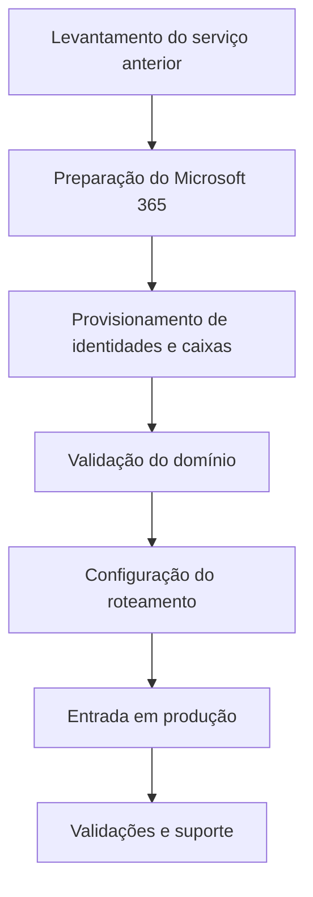

# 09 — Transição de serviços

## Classificação da atividade

A atividade realizada correspondeu à implantação e transição do serviço de e-mail para o Exchange Online. Não houve migração de mensagens históricas, importação de arquivos PST ou transferência de conteúdo por IMAP.

Também não houve migração documental inicial para o SharePoint, pois esse trabalho não fazia parte do escopo definido.

## Processo executado

### Validação durante a transição

A evidência acima representa a etapa de validação do domínio e dos registros associados ao novo serviço, com os valores operacionais sensíveis removidos.

## Dados históricos

Os dados do provedor anterior permaneceram fora da nova implantação. Por isso, o projeto não afirma migração integral ou equivalência de conteúdo entre os ambientes.

## Continuidade operacional

Registros legados potencialmente associados a outros serviços foram preservados quando suas dependências não estavam completamente mapeadas. A decisão priorizou a continuidade do ambiente de produção.

## Resultado

O Exchange Online passou a operar como plataforma corporativa de e-mail e a continuidade posterior foi acompanhada por suporte administrativo.
