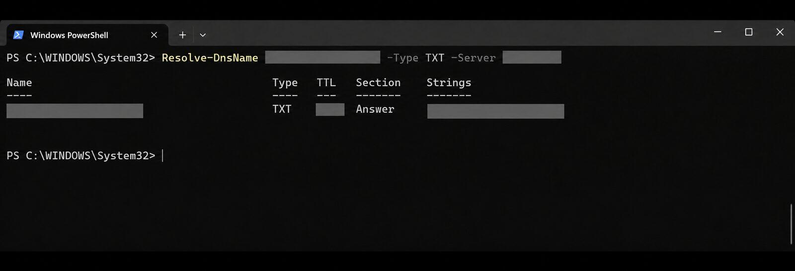

# 10 — Testes e validações

## Critério de documentação

Somente verificações sustentadas por estado administrativo, evidência técnica ou validação autorizada são apresentadas como concluídas.

## Matriz de validação do projeto

| Verificação | Estado | Método ou evidência |
|---|---|---|
| Domínio personalizado aceito pelo Microsoft 365 | Confirmado | Estado administrativo |
| Registros principais de e-mail | Confirmado | Centro administrativo |
| Resolução de DMARC | Confirmado | Consulta DNS |
| DKIM no domínio personalizado | Confirmado | Estado válido e habilitado |
| Caixas de usuário provisionadas | Confirmado | Estado administrativo |
| Lista de distribuição funcional | Confirmado | Configuração administrativa |
| Site de equipe privado | Confirmado | Estado administrativo |
| Grupos de segurança | Confirmado | Inspeção administrativa |
| Permissões por grupos | Confirmado | Inspeção administrativa |
| Versionamento nas bibliotecas | Confirmado | Evidência visual |
| Padrões de Segurança | Confirmado | Microsoft Entra ID |
| MFA administrativo | Confirmado | Login autorizado com Microsoft Authenticator |
| Envio e recebimento em cada caixa | Não testado individualmente | Sem acesso às caixas de colaboradores |
| Secure Score atualizado | Não confirmado | Evidência atualizada não incorporada |

## Evidências de validação

| Identidade e MFA | SharePoint e versionamento |
|---|---|
|  |  |
| **DKIM** | **DMARC** |
|  |  |

As capturas foram tratadas para manter a comprovação visual sem publicar contas, URLs, códigos temporários, valores DNS ou identificadores do ambiente.

## Limites dos testes

A validação interativa de autenticação foi realizada somente em conta administrativa autorizada. Contas e caixas de colaboradores não foram acessadas para produzir evidências.

O ambiente foi validado prioritariamente por estados administrativos e testes que não exigiam acesso ao conteúdo dos usuários.
