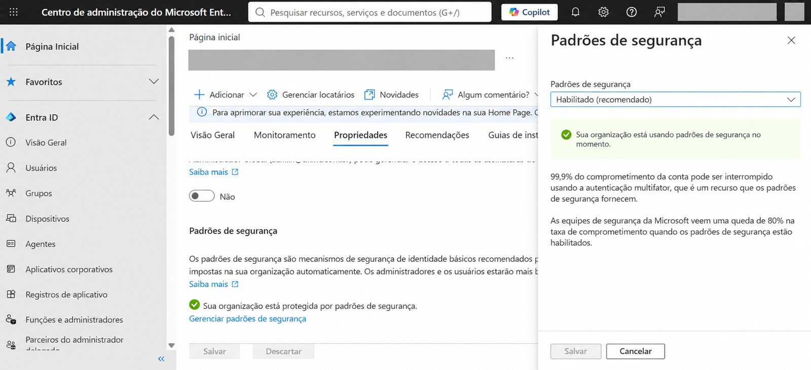
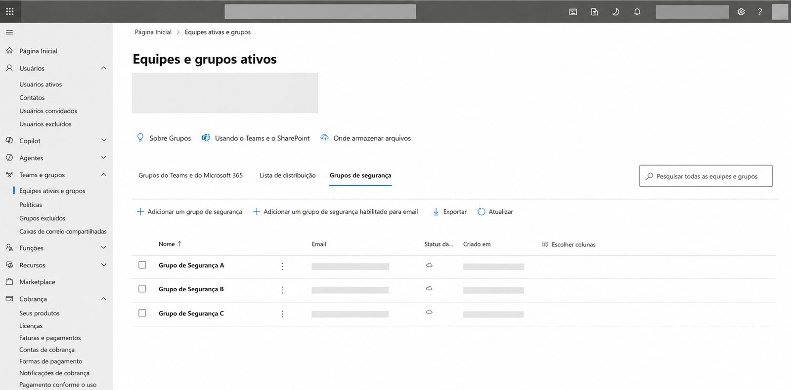

# 11 — Boas práticas de segurança

## Controles adotados no projeto

- Linha de base de segurança habilitada no Microsoft Entra ID.
- MFA administrativo com Microsoft Authenticator.
- Controle de acesso documental orientado a grupos.
- Site de equipe privado.
- Versionamento nas bibliotecas.
- SPF, DKIM e DMARC no domínio corporativo.
- Separação entre evidências privadas e documentação de portfólio.
- Validação sem acesso às caixas dos colaboradores.
- Preservação cautelosa de configurações de produção com dependências incertas.

## Evidências dos controles de identidade

| Padrões de Segurança | MFA |
|---|---|
|  |  |

Essas evidências demonstram os controles implementados sem publicar dados da conta administrativa ou do tenant.

## Controle de acesso e proteção documental

O modelo de grupos e o versionamento do SharePoint complementaram os controles de identidade ao reduzir concessões individuais e manter histórico de alterações nos documentos.

| Grupos de segurança | Versionamento |
|---|---|
|  |  |

## Menor privilégio

A administração por grupos facilita a governança, mas não representa sozinha garantia de menor privilégio. A efetividade desse princípio depende da revisão periódica das associações, níveis de acesso e exceções existentes.

## Secure Score

O Microsoft Secure Score foi utilizado como referência de postura e priorização. Ele não é apresentado como certificação de segurança nem como prova isolada de implementação de todos os controles recomendados.

## Evolução do ambiente

Revisões periódicas de grupos, compartilhamentos externos, métodos de recuperação administrativa, postura de segurança e política DMARC fazem parte da evolução natural do ambiente após a implantação inicial.
